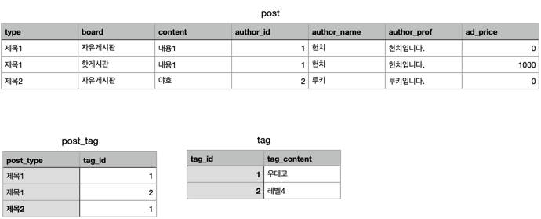
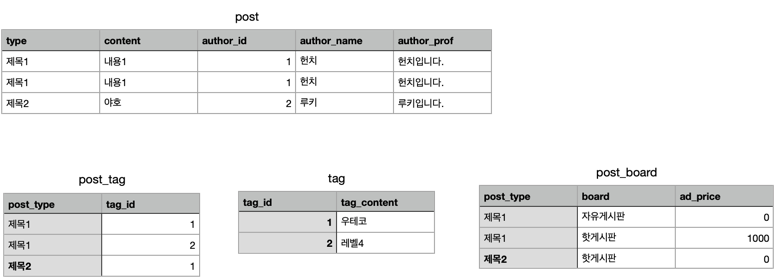
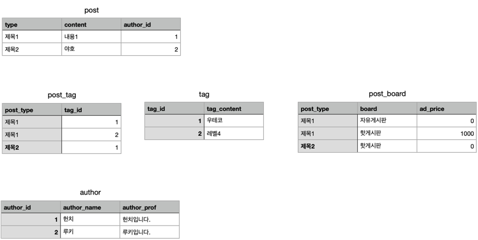

# DB 정규화
- 관계형 데이터베이스의 설계에서 중복을 최소화하게 데이터를 구조화하는 프로세스
- 에드거 F. 커드가 고안한 RDBMS 이상현상 제거 과정.
- 평범한 사람도 이 방법만 적용할 시, RDBMS에 걸맞는 천재적인 표를 만들 수 있는 레시피!

## 목적

- 중복을 배제하여 삽입, 삭제, 갱신 이상의 발생을 방지
- 각 릴레이션에 중복된 종속성을 여러개의 릴레이션에 분할
- 어떠한 릴레이션이라도 데이터베이스 내에서 표현 가능하게 함
- 데이터 삽입 시 릴레이션을 재구성할 필요성 감소
- 효과적인 검색 알고리즘 생성 가능

즉, 이상이 있는 관계를 재구성하여 작고 잘 조직된 관계를 생성하는 것에 있다.

## 이상 현상

### 삽입 이상 : 데이터 삽입 시 의도와 다른 값들도 삽입됨

신입 교수인 Dr. Newsome은 아직 수업을 배정받지 않았다는 이유로 교수 정보를 관리하는 이 테이블에 Newsome 교수 레코드를 삽입할 수가 없다.

### 삭제 이상 : 데이터 삭제 시 의도와 다른 값들도 연쇄 삭제된

ENG-206 수업이 끝나 해당 레코드를 삭제하면, Dr. Giddens 교수의 모든 정보가 삭제된다.

### 갱신 이상 : 속성값을 갱신했을 시, 일부 튜플만 갱신되어 모순 발생

Employee 519는 다른 레코드에서 다른 주소를 가지고 있다.

## 정규화 종류

이 중 에드가 F.커드가 제안한 정규화는 1-3NF, BCNF

각 정규화는 낮은 숫자(1NF->2NF...)부터 순서대로, 공정처럼 진행된다!

### 제1 정규화(1NF)

1NF를 만족하려면 도메인이 원자값이어야 한다.

### 제2 정규화(2NF)

2NF를 만족하려면 부분적 함수 종속을 제거해야 한다.
- 즉 완전 함수 종속이 되도록 해야 한다.

### 제3 정규화(3NF)

3NF를 만족하려면 이행적 함수 종속을 제거해야 한다.
- 이행적 함수 종속: A→B 이고 B→C 일 때 A→C 인 관계

## 참고자료

- https://itwiki.kr/w/%EB%8D%B0%EC%9D%B4%ED%84%B0%EB%B2%A0%EC%9D%B4%EC%8A%A4_%EC%A0%95%EA%B7%9C%ED%99%94
- https://ko.wikipedia.org/wiki/%EB%8D%B0%EC%9D%B4%ED%84%B0%EB%B2%A0%EC%9D%B4%EC%8A%A4_%EC%A0%95%EA%B7%9C%ED%99%94
- 생활코딩 정규화
