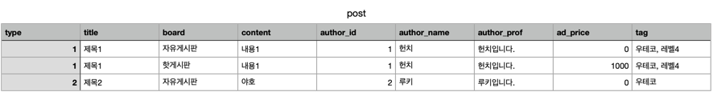
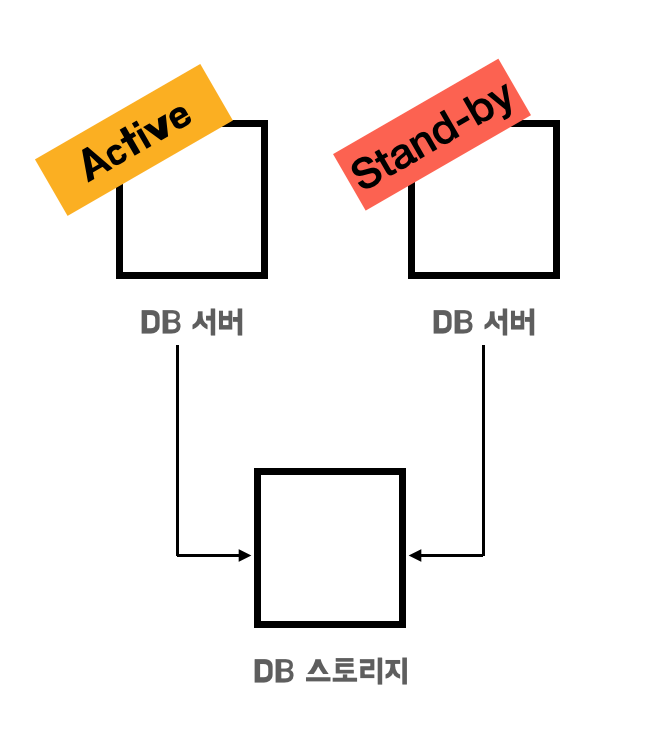
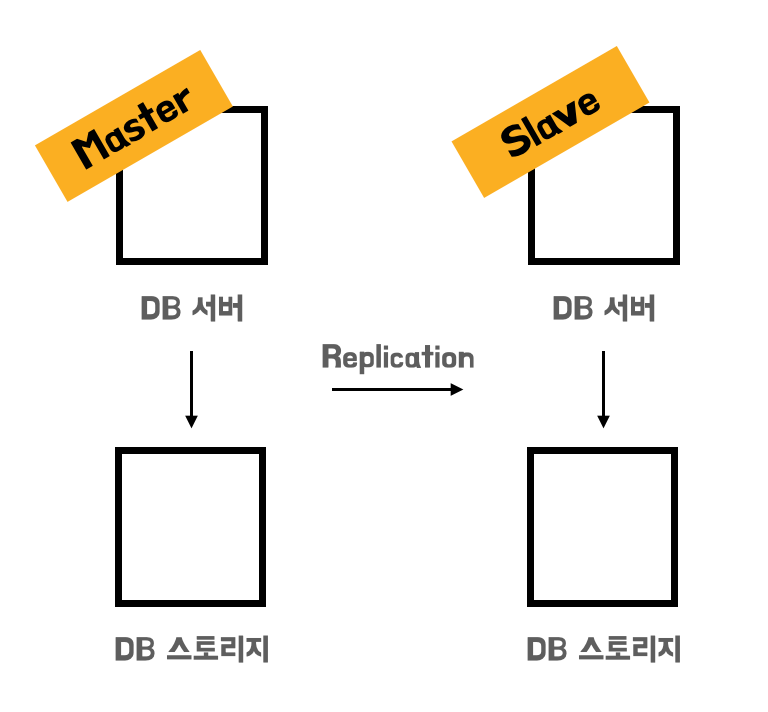
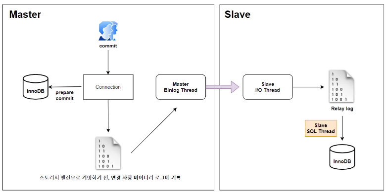
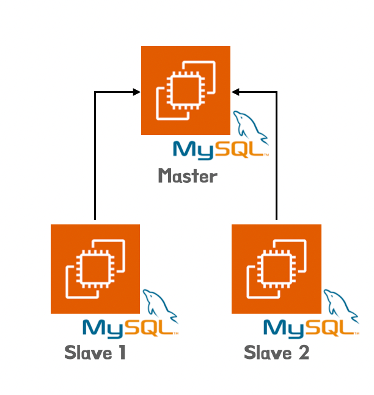

## DB 성능 확장 방법

DB의 성능을 높이기 위해서는 `Scale up` 또는 `Scale out` 하여 성능을 높여야 합니다. 현재 진행하는 프로젝트에서는 `Scale up`을 하기 위한 자원을 제공받을 수 없는 상황이기 때문에, `Scale up`은 고려하지 않고 `Scale out`을 적용하기로 결정했습니다.

DB를 `Scale out`하는 방법은 `Clusterning`과 `Replication`으로 구분할 수 있습니다. 한번 각각의 방법에 대해서 알아보도록 합시다.

### Clustering

`Clusterning`은 DB 서버를 2대 이상, DB 스토지리를 1대로 구성하는 형태입니다. **DB 서버 2대를 모두 `Active` 상태로 운영한다면, DB 서버 1대가 죽더라도 다른 DB 서버 1대는 살아있어 서비스를 정상적**으로 할 수 있습니다. 또한 DB 서버를 여러대로 두게되면, 트래픽을 분산하여 감당하게 되어 CPU와 Memory 부하가 적어지는 장점이 존재합니다.

하지만, **DB 서버들이 하나의 DB 스토리지를 공유하기 때문에 DB 스토리지에 병목이 생기는 단점**이 존재합니다.

이를 해결하기 위해서 DB 서대 2대 중 1대를 `Stand-by` 즉, 사용대기 상태로 두어 단점을 보안할 수 있습니다. **`Stand-by` 상태의 서버는 `Active` 상태의 서버에 문제가 생겼을 때, `Fail Over`를 하여 상호 전환을 하여 장애에 대응**을 할 수 있습니다. 이를 통해서, DB 스토리지에 대한 병목 현상도 해결할 수 있습니다.

하지만, **`Fail Over`가 발생하는 시간 동안은 손실이 존재하며, DB 서버 비용은 그대로인데 가용률이 1/2가 된다는 단점이 존재**합니다.

또한, `Clustering`이 가지는 본질적인 **문제로 DB 스토리지에 문제가 발생하면, 데이터를 복구할 수 없다는 치명적인 문제**가 존재합니다.

### Replication

`Replication`은 각 DB 서버가 각자 DB 스토리지를 가지고 있는 형태입니다. 그리고 이를 실시간으로 동기화하면서 트래픽을 여러 MySQL 서버로 분산시켜주기 때문에 데이터베이스로 인한 병목 현상을 개선할 수 있습니다.

`Master`와 `Slave`로 구성된 구조는 `Master` 서버에는 INSERT, UPDATE, DELETE 작업이 전달되고 `Slave` 서버에는 SELECT 작업을 전달합니다. `Slave`는 결국 `Master` 서버에서 복제된 데이터이기 때문에 데이터의 조작이 발생할 수 있는 INSERT, UPDATE, DELETE 작업은 `Master`로 전달이 되고 조회만을 하는 SELECT 작업은 `Slave` 서버를 통하여 진행하게 됩니다.

위의 그림에서는 `Slave` 서버가 하나뿐이지만 서비스에 맞게 `Slave` 서버를 여러 개로 설정할 수도 있습니다. **데이터베이스에서 발생하는 대부분의 쿼리는 조회인 SELECT인데 이러한 것을 `Slave` 서버를 통해 분산하여 처리할 수 있으니 좀 더 성능 향상을 가져갈 수 있습니다**.

MySQL에서의 `Replication` 동작과정을 조금 더 자세히 살펴보면 다음과 같습니다.

1. 사용자가 INSERT, UPDATE, DELETE 쿼리를 `Master` 서버로 요청하면, `Master` 서버는 이를 처리하고 `Master` 서버에서 일어나는 모든 변경 이력들을 **바이너리 로그 스레드**를 사용해서 **바이너리 로그**에 저장한다.
2. `Slave` 서버에서 변경 내역을 요청하면 `Master` 서버의 바이너리 **로그 덤프 스레드**가 바이너리 로그들을 읽어서 `Slave` 서버로 데이터를 전달한다.
3.  `Slave` 서버의 **Slave I/O 스레드**가 요청한 변경 내역들을 `Slave` 서버의 **릴레이 로그**에 저장합니다.
4. 최종적으로 `Slave` 서버의 **Slave SQL 스레드**가 **릴레이 로그**에 기록된 데이터들을 읽어서 `Slave` 서버에 적용합니다.

> 바이너리 로그란?
>

`Master` 노드에서의 `DDL` or `DML` 가운데 데이터의 구조나 내용을 변경하는 모든 쿼리 문장과 이력을 기록하는 논리적인 로그를 말합니다.

전체적인 흐름은 다음 도식과 같습니다.

### 그래서.. 어떤 선택을?

결론적으로 `DB Scale out`을 하는 방법으로 `Replication`을 선택하기로 했습니다. 이렇게 구성하게 될 경우 DB 스토리지를 여러개로 두기 때문에, 데이터 복구를 못하는 상황을 어느정도 방지할 수 있으며, `Clustering`과 다르게 DB 가용률을 최대로 가져갈 수 있다는 장점을 가져갈 수 있다고 생각했기 때문입니다.

여기서 고민인 점은 `Slave DB`를 몇대로 설정하는가 입니다. 현재로써는 서비스 사용자가 많지 않기 때문에 `Master 1`, `Slave 1` 구조로 선택해도 문제가 없습니다. 하지만 현재 진행하는 설계는 다수의 사용자를 고려하여 진행하고 있기 때문에 추후 확장에 용이하도록 **N개의 Slave DB를 기준으로 설계**를 하기로 하였습니다.

>참고한 곳

* https://wishoon.github.io/Replication%EA%B3%BC-SpringBoot/