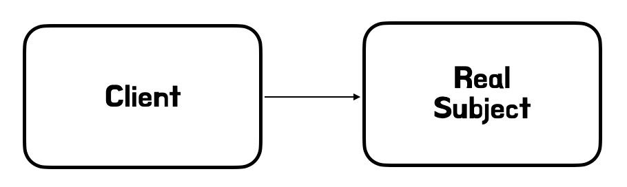
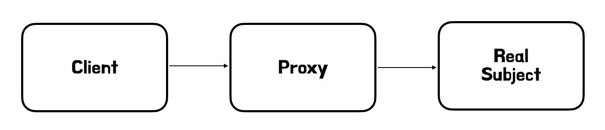
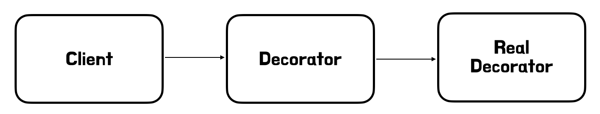

# Proxy 패턴

## 배경

만약 프로덕션 코드가 존재하고, 새로운 요구사항으로 프로덕션 코드를 수정하지 않고 로그를 도입하라 라는 요구사항이 생겼다고 가정하자. 이런 문제를 해결하기 위해서 `Proxy` 를 사용할 수 있다.


## 프록시

클라이언트가 요청한 결과를 서버에 직접 요청하는 것이 아니라 어떤 대리자를 통해서 대신 간접적으로 서버에 요청하는 것을 `Proxy`라고 할 수 있다.

여기서 Proxy가 할 수 있는 일은 다음과 같다.

1. 클라이언트가 서버에게 A 요청을 했는데, 이미 A 요청에 대한 결과를 중간에서 알고 있다. 이로인해, 훨씬 더 빠르게 요청을 받을 수 있다. -> **캐싱, 접근 제어**
2. 클라이언트가 서버에게 B 요청을 했는데, C라는 기능까지 함께 처리해서 전달해주었다. -> **부가 기능 추가**
3. 클라이언트가 서버에게 C 요청을 했는데, 중간에서 대리자가 C 요청을 다른 대리자에게 맏길 수도 있다. 중요한 점은, 클라이언트는 대리자가 다른 대리자에게 요청을 했는지 모른다는 점이다. -> **프록시 체인**


위에서 말한 프록시는 아무 객체나 될 수는 없다. 객체에서 프록시가 되기 위해서, 클라이언트는 서버에서 요청을 한 것인지, 프록시에게 요청을 한 것인지 몰라야 한다. 즉, 이 말을 정리하면 `클라이언트는 서버와 프록시가 사용하는 인터페이스에 요청을 한다`라고 말할 수 있다.


### 프록시의 주요 기능

위의 내용을 한번 더 정리한다면, 크게 2가지로 구분할 수 있다.

* 접근 제어
    * 권한에 따른 접근 차단
    * 캐싱
    * 지연 로딩

* 부가 기능 추가
    * 원래 서버가 제공하는 기능에 더해서 부가 기능을 수행
        * ex 1) 요청 값이나, 응답 값을 중간에 변경
        * ex 2) 실행 시간을 측정해서 추가 로그를 기록


## 프록시 패턴

프록시 패턴은 프록시를 사용하는 여러 패턴 중 명칭이 프록시 패턴이라고 불리는 패턴이며, `접근 제어`를 목적으로 사용된다.

만약, 요청에 1초가 소요되는 로직을 3번 호출했다고 가정하자. 데이터를 조회하는데 1초가 소모되기 때문에 총 3초의 시간이 소모된다.

``` java
operation - 객체 호출 (1)
operation - 객체 호출 (2)
operation - 객체 호출 (3)
```




여기서 만약에, 이 데이터가 변하지 않는 데이터라고 가정한다면, 어딘가에 보관을해두고 이미 조회한 데이터를 사용하는 것이 성능상 훨씬 좋다. 이를 `캐시`라고 한다.


``` java
operation - 객체 호출 (1)
```



간단한 코드를 통해 `Proxy` 패턴을 파악할 수 있다.

``` java
public class CasheProxy implements Subject {

	private Subject target;
	private String casheValue;

	public CasheProxy(Subject subject) {
		this.target = target;
	}

	@Override
	public String oppration() {
		log.info("프록시 호출");
		if (casheValue == null) {
			casheValue = target.opperation();
		}
		return casheValue;
	}
}
```


이러한 일련의 과정들을 설명하면, 프록시 패턴의 핵심은 서버 코드와 클라이언트 코드를 변경하지 않고, 프록시를 도입해서 접근 제어를 했다는 점이다. 클라이언트의 코드 변화 없이 자유롭게 프록시의 추가와 제거가 가능하고, 클라이언트는 이를 인지하지 못한다.


## 데코레이터 패턴

데코레이터 패턴은 프록시를 활용해 부가 기능을 추가하는 패턴을 말한다. 부가 기능은 앞에서도 정리했지만 크게 다음과 같다.

* 부가 기능 추가
    * 원래 서버가 제공하는 기능에 더해서 부가 기능을 수행
        * ex 1) 요청 값이나, 응답 값을 중간에 변경
        * ex 2) 실행 시간을 측정해서 추가 로그를 기록


### 응답 값을 꾸며주는 데코레이터

데코레이터를 보면 중복이 존재한다. 또한 꾸머주는 역할을 하기 때문에 `Decorator`는 스스로 존재할 수 없다. 따라서 내부 호출 대상인 `Component`를 가지고 있어야 한다. 그리고 해당 `Component`를 무조건 호출해야 한다.



간단한 코드를 통해 데코레이터 패턴을 파악할 수 있다.

``` java
public class CouponControllerInterfaceProxy implements CouponController {

	private final CouponController target;
	private final LogTrace logTrace;

	@Override
	public String showCoupon(String couponId) {

		TraceStatus status = null;
		String data = null;
		try {
			status = logTrace.begin("CouponController.showCoupon()");
			result = target.showCoupon(couponId);
			logTrace.end(status);
		} catch (Exception e) {
			...
		}
		return result;
	}

	@Override
	public Stirng noLog() {
		return target.noLog();
	}
}
```

``` java
@Configuration
public class InterfaceProxyConfig {

	@Bean
	public CouponController couponController(LogTrace logTrace) {
		OrderControllerImpl orderControllerImpl = new OrderControllerImpl();
		return new CouponControllerInterfaceProxy(orderControllerImpl, logTrace);
	}
}
```

정리하자면 데코레이터 패턴은 `Runtime`에 `Real Object`의 기능을 확장하고 싶을 때 사용한다고 할 수 있음. 중요한 점은 부가 기능은 `데코레이터`에, 핵심기능은 `Real Object`에 존재하며, 부가기능이 핵심기능을 사용하는 구조로 만들어야 한다는 점이다.


## 프록시 패턴 vs 데코레이터 패턴

최종적으로 프록시 패턴과 데코레이터 패턴을 비교하자면, 그 패턴의 의도를 파악해야 한다. (왜나하면 겉모양이 거의 비슷하거 같기도 하기 때문)

* 프록시 패턴의 의도 : 다른 개채에 대한 접근을 제어하기 위해 대리자를 제공
* 데코레이터 패턴의 의도 : 객체에 추가 책임(기능)을 동적으로 추가하고, 기능 확장을 위한 유연한 대안 제공


## 인터페이스 기반 프록시 vs 클래스 기반 프록시

인터페이스가 없어도 (콘크리트)클래스 기반으로 프록시를 생성할 수 있다. 각각의 장, 단점을 나누면 다음과 같다.

> 클래스 기반 프록시

* 부모 클래스의 생성자를 호출
* 클래스의 final 키워드가 붙으면 사용불가능
* 메서드의 final 키워드가 붙으면 오버라이딩 불가능

> 인터페이스 기반 프록시

* 인터페이스를 하나 생성해줘야 함
* 캐스팅에 문제가 있음 (ClassCastException.class)
