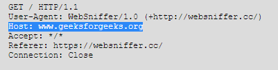
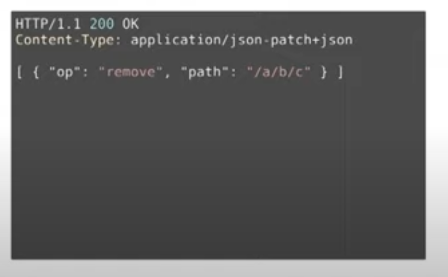
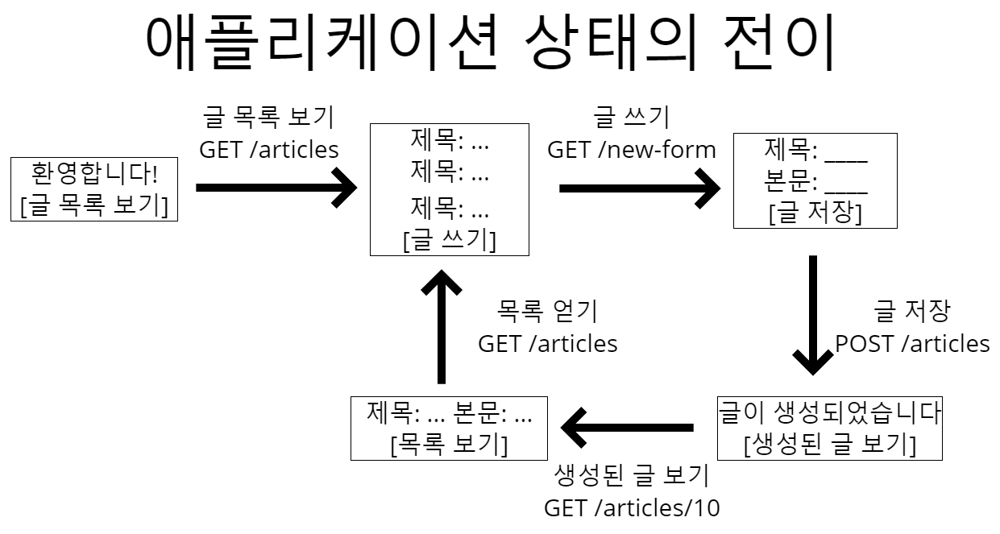

# 🙆 ‍진짜 REST 🙆‍

## 💬 정의

### **REST**

REST는 Representational State Transfer(REST)의 약자로, API 작동 방식에 대한 조건을 부과하는 소프트웨어 아키텍처이다.

로이 필딩이 창시했다.

인터넷과 같은 복잡한 네트워크에서 통신을 관리하기 위한 지침으로 만들어졌다.

### REST API

API 개발자는 여러 아키텍처를 사용하여 API를 설계할 수 있다. REST 아키텍처 스타일을 따르는 API를 REST API라고 한다.

### RESTful web service

REST 아키텍처를 구현하는 웹 서비스를 RESTful 웹 서비스라고 한다.

### 표현(Representation of Resource)

Client와 Server가 데이터를 주고받는 형태이다.

JSON, XML, TEXT, RSS 등이 있다.

## 📄 특징

요새 대다수 API는 4번 빼고 잘 지켜진다.

### 1. Server-Client(서버-클라이언트 구조)

자원이 있는 쪽이 Server, 자원을 요청하는 쪽이 Client이다. 둘은 독립적이다.

### 2. Stateless(무상태)

서버는 이전의 모든 요청과 독립적으로 모든 클라이언트 요청을 완료한다.

클라이언트는 임의의 순서로 리소스를 요청할 수 있으며 모든 요청은 무상태이거나 다른 요청과 분리된다.

### 3. Cacheable(캐시 가능성)

RESTful 웹 서비스는 서버 응답 시간을 개선하기 위해 클라이언트 또는 중개자에 일부 응답을 저장하는 프로세스인 캐싱을 지원한다.

### 4. Uniform Interface(인터페이스 일관성) : 핵심

URI로 지정한 Resource에 대한 조작을 통일되고 한정적인 인터페이스로 수행한다. HTTP 표준 프로토콜에 따르는 모든 플랫폼에서 사용이 가능하다. 특정 언어나 기술에 종속되지 않는다.

### 5. Layered System(계층화)

계층화된 시스템 아키텍처에서 클라이언트는 클라이언트와 서버 사이의 다른 승인된 중개자(보안, 애플리케이션 및 비즈니스 로직 등)에게 연결할 수 있다.

### 6. Code-On-Demand(온디맨드 코드) : optional

REST 아키텍처 스타일에서 서버는 소프트웨어 프로그래밍 코드를 클라이언트에 전송하여 클라이언트 기능을 일시적으로 확장하거나 사용자 지정할 수 있다. → 자바스크립트

## 👀 4번 Uniform Interface 제약조건 파헤치기

### 1. identification of resources

리소스는 uri를 통해 식별된다.

### 2. manipulation of resources through representational

representation(표현) 전송을 통해 리소스를 조작해야 한다.

즉 리소스 CRUD 시 메세지에 표현을 담아야 한다.

### 3. self-descriptive(확장 가능한 커뮤니케이션) : 문제





메세지는 스스로를 설명해야 한다.

- 모든 요청 메세지에는 목적지를 나타내기 위해 `Host`가 추가되어야 한다.
- 모든 응답 메세지에는 바디값 문법 해석 방법을 알려주기 위해 `Content-Type`이 추가되어야 한다.
    - 최근 대다수 API에선 잘 지켜지지 않는다.(`application/json`까지만 적는 경우가 많음)

HTML의 경우 self-descriptive 를 만족하지만, JSON은 만족하지 않는다.

### 4. HATEOAS(애플리케이션 상태 전이의 late binding) : 문제



HATEOAS : hypermedia as the engine of application state 의 줄임말

어플리케이션의 상태는 Hyperlink를 이용해 전이되어야 한다. 링크는 동적으로 변경될 수 있기 때문이다.

HTML의 경우 HATEOAS를 만족하지만, JSON은 만족하지 않는다!

## ❤️ REST의 **이점**

### 1. 확장성

REST API를 구현하는 시스템은

- REST가 클라이언트-서버 상호 작용을 최적화하기 때문에 효율적으로 크기 조정할 수 있습니다.
- 무상태는 서버가 과거 클라이언트 요청 정보를 유지할 필요가 없기 때문에 서버 로드를 제거합니다.
- 잘 관리된 캐싱은 일부 클라이언트-서버 상호 작용을 부분적으로 또는 완전히 제거합니다.

이러한 모든 기능은 성능을 저하시키는 통신 병목 현상을 일으키지 않으면서 확장성을 지원합니다.

### 2. 유연성

RESTful 웹 서비스는

- 완전한 클라이언트-서버 분리를 지원합니다. 각 부분이 독립적으로 발전할 수 있도록 다양한 서버 구성 요소를 단순화하고 분리합니다. 서버 애플리케이션의 플랫폼 또는 기술 변경은 클라이언트 애플리케이션에 영향을 주지
  않습니다.
- 애플리케이션 함수를 계층화하는 기능은 유연성을 더욱 향상시킵니다. 예를 들어, 개발자는 애플리케이션 로직을 다시 작성하지 않고도 데이터베이스 계층을 변경할 수 있습니다.

### 3. 독립성(독립적 진화)

REST API는 사용되는 기술과 독립적입니다.

API 설계에 영향을 주지 않고 다양한 프로그래밍 언어로 클라이언트 및 서버 애플리케이션을 모두 작성할 수 있다.

또한 통신에 영향을 주지 않고 양쪽(서버, 클라이언트)의 기본 기술을 변경할 수 있다.

즉, 서버의 기능이 변경되어도 클라이언트를 업데이트할 필요가 없다. 이것이 로이필딩이 REST를 만들게 된 계기이다.

## 🙃 REST를 따라야 하는가?

> 시스템 전체를 통제할 수 있다고 생각하거나, 진화에 관심이 없다면, REST에 대해 따지느라 시간을 낭비하지 마라 - 로이 필딩
>

이 경우 따르지 않아도 된다.

1. 클라이언트-서버 개발자 사이에서 의사소통이 가능하다.
2. 직접 클라이언트, 서버를 모두 구현한다.
3. 지속적인 업데이트→괜찮다!

만약 오랜 시간동안 진화하는(변경 없이 갈 수 있는) 어플리케이션을 만들고 싶다면, `RESTful API`를 따르는 게 좋다.

## 🙀 진짜 RESTful API 만드는법

### Self-descriptive

**Media type 정의**

```
GET /todos HTTP/1.1
Host: example.org

HTTP/1.1 200 OK
Content-Type: application/vnd.todos+json

[
	{"id": 1, "title": "회사 가기"},
	{"id": 2, "title": "집에 가기"}
]
```

1. 미디어 타입을 하나 정의
2. 미디어 타입 문서 작성 → "id", "title"의 의미 정의
3. IANA에 미디어 타입을 등록. 이때 만든 문서를 미디어 타입의 명세로 등록
4. 이제 이 메시지를 보는 사람은 명세를 찾아갈 수 있음 → 메세시지 의미 온전히 해석 가능
5. Success

단점 : 매번 media type 정의

**Profile 이용**

```
GET /todos HTTP/1.1
Host: example.org

HTTP/1.1 200 OK
Content-Type: application/json
Link: <https://exmaple.org/docs/todos>; rel="profile"

[
	{"id": 1, "title": "회사 가기"},
	{"id": 2, "title": "집에 가기"}
]
```

1. "id", "title" 의미 정의한 명세 작성
2. Link 헤더에 profile relation으로 명세 링크
3. 이제 메시지를 보는 사람은 명세를 찾아갈 수 있음 → 의미 해석 가능
4. Success

**단점**

- 클라이언트가 Link 헤더(RFC5988)와 profile(RFC 6906)을 이해해야함.
- **Content negotiation 불가**

### HATEOAS

**data에 다양한 방법으로 하이퍼링크 표현**

```
GET /todos HTTP/1.1
Host: example.org

HTTP/1.1 200 OK
Content-Type: application/json
Link: <https://exmaple.org/docs/todos>; rel="profile"

[
	{
		"link": "https://exmplae.org/todos/1,
		"title": "회사 가기"
	},
	{
		"link": "https://exmplae.org/todos/2,
		"title": "회사 가기"
	},
]
```

```
GET /todos HTTP/1.1
Host: example.org

HTTP/1.1 200 OK
Content-Type: application/json
Link: <https://exmaple.org/docs/todos>; rel="profile"

{
	"links" : {
		"todo" : "https://example.org/todos/{id}"
	},
	"data": [{
		"id": 1,
		"title": "회사 가기"
	}, {
		"id": 2,
		"title": "집에 가기"
	}]
}
```

단점 : 링크를 표현하는 방법을 직접 정의

**JSON으로 하이퍼링크를 표현하는 방법을 정의한 명세들을 활용**

```
GET /todos HTTP/1.1
Host: example.org

HTTP/1.1 200 OK
Content-Type: application/vnd.api+json
Link: <https://exmaple.org/docs/todos>; rel="profile"

{
	"data": [{
		"type": "todo",
		"id": 1,
		"attributes": {"title": "회사 가기"},
	"links" : { "self": "https://example.org/todos/1"
	},{
		"type": "todo",
		"id": 2,
		"attributes": {"title": "집에 가기"},
	"links" : { "self": "https://example.org/todos/2"
	}]
}
```

단점 : 기존 API를 많이 고쳐야한다. (침투적)

**HTTP 헤더로 → Link, Location 등**

```
POST /todos HTTP/1.1
Content-Type: application/json

{
		"title": "점심 약속"
}

HTTP/1.1 204 No Content
Location: /todos/1
Link: </todos/>, rel="collection"
```

data, 헤더 모두 사용하면 좋다.

## 🖊 정리(feat.그런 REST API로 괜찮은가)

- 오늘날 대부분 "REST API"는 사실 REST를 따르고 있지 않다.
- REST의 제약 조건 중 특히 **self-descriptive와 HATEOAS**를 잘 만족하지 못한다.
- REST **긴 시간에 걸쳐(수십년) 진화**하는 웹 애플리케이션을 위한 것
- REST를 따를 것인지는 API 설계하는 이들이 스스로 판단하여 결정
- REST를 따르겠다면 **Self-decriptive와 HATEOAS**를 만족시켜야한다.
    - Self-decriptiv는 **custom media type, profile link relation**으로 만족 가능
    - HATEOAS는 **HTTP 헤더**나 본문에 **링크**를 담아 만족 가능
- REST를 따르지 않겠다면, "REST를 만족하지 않는 REST API"를 뭐라고 부를지 결정해야할 것이다.
    - HTTP API라고 부를 수도 있고
    - 그냥 이대로 REST API라고 부를 수도 → 로이가 싫어함

---

# 🥰 가짜 REST : RESTful API 가이드라인 ([feat.마이크로소프트](https://docs.microsoft.com/ko-kr/azure/architecture/best-practices/api-design))

> 여기서부턴 로이 필딩의 RESTful API가 아닌, 이를 해석한 사람들(정확히는, 마이크로소프트 docs)의 `RESTful API`이다!
>

## 🤝 RESTful API 요청 구성요소 가이드라인

RESTful API에는 다음 두 구성요소를 포함하는 요청이 필요하다.

### 1. 자원(Resource) - URL

REST 서비스의 경우 서버는 일반적으로 URL을 사용하여 리소스 식별을 수행한다. URL은 리소스에 대한 경로를 지정한다.

### 2. 행위 - Method

HTTP 메서드는 리소스에 수행해야 하는 작업을 서버에 알려준다.

**GET(Read)**

서버의 지정된 URL에 있는 리소스에 접근한다.

이때 API 요청에 파라미터를 넣어 전송하여 전송 전에 데이터를 필터링할 수 있다.

**POST(Create)**

서버에 데이터를 전송한다.

여기에는 요청과 함께 데이터 표현이 포함된다.

**PUT(Update)**

서버의 기존 리소스를 전체 업데이트한다.

**PATCH(Update)**

서버의 기존 리소스를 일부 업데이트한다.

**DELETE(Delete)**

리소스를 제거한다.

### HTTP 헤더

요청 헤더는 클라이언트와 서버 간에 교환되는 메타데이터입니다. 예를 들어, 요청 헤더는 요청 및 응답의 형식을 나타내고 요청 상태 등에 대한 정보를 제공합니다.

**데이터**

REST API 요청에는 POST, PUT 및 기타 HTTP 메서드가 성공적으로 작동하기 위한 데이터가 포함될 수 있습니다.

**파라미터**

RESTful API 요청에는 수행해야 할 작업에 대한 자세한 정보를 서버에 제공하는 파라미터가 포함될 수 있습니다. 다음은 몇 가지 파라미터 유형입니다.

- URL 세부정보를 지정하는 경로 파라미터.
- 리소스에 대한 추가 정보를 요청하는 쿼리 파라미터.
- 클라이언트를 빠르게 인증하는 쿠키 파라미터.

## 🔗URL 가이드라인

### **슬래시( / )로 계층 관계를 표현한다. 이때** 마지막에 “/”포함하지 않는다.

**BAD**

```bash
http://api.test.com/users/1/
```

**GOOD**

```
http://api.test.com/users/1
```

### _(underbar) 대신 -(dash)를 사용한다.

**BAD**

```
http://api.test.com/users/post_commnets
```

**GOOD**

```
http://api.test.com/users/post-commnets
```

### 소문자를 사용한다.

**BAD**

```
http://api.test.com/users/postCommnets
```

**GOOD**

```
http://api.test.com/users/post-commnets
```

### **명사를 사용한다.**

**BAD**

```
POST http://api.test.com/users/1/delete-post/1
```

**GOOD**

```
DELETE http://api.test.com/users/1/posts/1
```

### 컨트롤 자원을 의미하는 URL 예외적으로 동사를 허용한다.

**BAD**

```
http://api.test.com/posts/duplicating
```

**GOOD**

```
http://api.test.com/posts/duplicate
```

### **파일확장자는 URI에 포함하지 않는다.**

**BAD**

```
http://api.test.com/posts/1/photo.jpg
```

**GOOD**

```
http://api.test.com/posts/1/photo
```

---

# 📚 참고자료

### 이태리 피자

[Day1, 2-2. 그런 REST API로 괜찮은가](https://www.youtube.com/watch?v=RP_f5dMoHFc)

[RESTful API란 무엇인가? - RESTful API 초보자 가이드 - AWS](https://aws.amazon.com/ko/what-is/restful-api/)

### 한국 콤비네이션 피자

[[Network] REST란? REST API란? RESTful이란? - Heee's Development Blog](https://gmlwjd9405.github.io/2018/09/21/rest-and-restful.html)

[웹 API 디자인 모범 사례 - Azure Architecture Center](https://docs.microsoft.com/ko-kr/azure/architecture/best-practices/api-design)

[api-guidelines/Guidelines.md at master · microsoft/api-guidelines](https://github.com/Microsoft/api-guidelines/blob/master/Guidelines.md)
