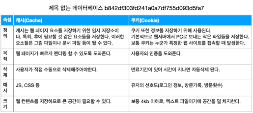
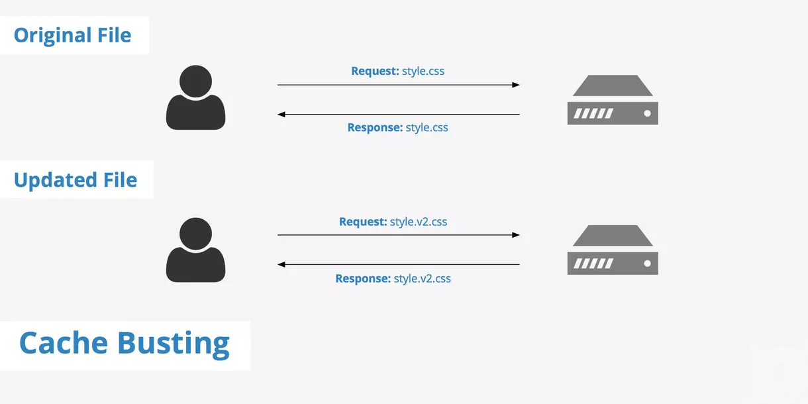

# 💶 (웹) 캐시

[**캐시**](https://ko.wikipedia.org/wiki/%EC%BA%90%EC%8B%9C) 는 데이터나 값을 임시로 복사해두는 임시 장소이다. 캐시의 접근 시간에 비해 원래 데이터를 접근하는 시간이 오래 걸리는 경우나 값을 다시 계산하는 시간을 절약하고 싶은 경우에 사용한다.

## 캐싱

주어진 리소스의 복사본을 캐시에 저장하고 있다가, 요청 시 그것을 제공하는 기술이다.

## 캐싱의 장점

클라이언트의 경우, 캐싱을 통해 웹사이트가 좀 더 빠르게 반응하도록 만들 수 있다. 즉 성능이 향상된다.

서버 역시 기존에 오던 데이터가 오지 않게 되니 요청 부하를 줄일 수 있다.

## 쿠키 vs 캐시

# 정의



둘다 웹 브라우저 상에서 저장되는 정보이지만 그 쓰임새가 다르다.

쿠키는 사용자 인증 정보를 저장하는 용도이다. 다시 사용자 재인증(로그인 등)을 거치지 않아도 된다는 편리함 때문에 사용된다.

캐시는 웹사이트가 다시 서버로 요청을 보내지 않아도 되니 성능상 이점이 있다. 주로 JS, CSS 등의 파일들이 캐싱된다.

# HTTP 캐시

## 종류

### Private Cache

웹 브라우저에 저장되는 캐시. 한명의 사용자만 사용한다.

다른 사람은 접근할 수 없다.

서버 응답 헤더 중 `Authorization`이 포함되어 있을 시 `Private Cache`에 저장되지 않는다.

### Shared Cache

웹 브라우저와 서버 사이에서 동작한다. 한명 이상의 사용자가 재사용할 수 있다.

`Proxy Cache`와 `Managed Cache`로 나뉜다.

1. `Proxy Cache`는 포워드 프록시에서 동작하는 캐시이다.
2. `Managed Cache`는 AWS나 Cloudfront 등 CDN 서비스, 리버스 프록시에서 동작하는 캐시이다. 이런 캐시들은 관리자 패널이나 리버스 프록시 설정으로 관리 가능해 `Managed Cache`(관리되는 캐시)라고 불린다.

## `Cache-Control`

캐싱 제어를 위해 `Cache-Control` 이라는 HTTP 헤더를 쓴다.

해당 헤더가 없을 시 휴리스틱 캐싱(암묵적 캐싱)이 일어날 수 있다.

### 캐시 여부

캐싱하지 않을 시 `no-store`을 사용한다. 서버 응답을 전혀 저장하지 않는다.

캐싱하지만 재검증, 즉 **유효성 확인**을 하고 싶을 땐 `no-cache`를 사용한다.

웹캐시 일관성 기법 중 `polling-every-time`(매번 재검증-유효성 확인) 형태를 사용하게 된다.

### 사설(브라우저) 캐시와 공유(프록시) 캐시

`public` 은 응답 시 어떤 캐시에서 캐싱되어도 좋다는 뜻이다. 공유 캐시에 저장되어도 좋다.

`private` 은 응답을 단일 사용자만을 위해 사용해야 하며, 공유 캐시에 저장되면 안된다는 뜻이다.

### 만료

`max-age`로 캐시의 최대 수명 설정이 가능하다. 단위는 “초” 이다.

캐시된 데이터가 유효할 땐 **fresh**(신선한)라고,

캐시 시간이 초과된 경우 **stale**(신선하지 않은)라고 한다.

예전엔 관련해 `Expires` 헤더를 썼지만, 지금은 잘 쓰지 않는다.

### 검증

`must-revalidate` 사용 시, 오래된 리소스를 사용하기 전 상태를 확인하기 위해 **캐시 검증**을 진행하게 된다.

예전엔 `max-age=0`과 함께 이 헤더를 썼지만, 지금은 `no-cache`로 재검증을 진행한다. `max-age=0` 이 먹히지 않는 브라우저가 있어서 그렇다고 한다.

## 캐시 검증

캐시 유효기간이 지났을 때, 서버의 데이터가 여전히 캐싱된 데이터와 같을 수 있다.

이때 트래픽 낭비를 줄이기 위해 **캐시 검증** 및 **조건부 요청**을 할 수 있다.

보통 사용자가 리로드 버튼을 눌렀을 경우 촉발된다.

`no-cache`나 `must-revalidate` 사용 시, 일반적인 브라우징 중에도 촉발된다.

캐시 검증을 위한 두가지 방법이 있다.

### If-Modified-Since(Last-Modified)

리소스의 **마지막 갱신 시간**으로 검증함.

**첫 요청**

`Last-Modified` 헤더엔 요청한 리소스가 마지막으로 수정된 일자가 들어간다. 브라우저는 이 일자를 저장한다.

**조건부 요청**

이후 캐시 기간이 초과된 요청을 받았을 시, 브라우저는 이 일자 값을 `If-Modified-Since` 요청 헤더에 넣어 서버로 전달한다.

만약 원본 리소스에 변경사항이 없으면 304(Not Modified) 상태코드로 응답한다. 해당 응답엔 바디가 비어있다.

변경사항이 있을 시 200(OK)를 응답한다. 해당 응답엔 서버에서 온 바디가 있다.

### If-None-Match(ETag)

리소스의 **식별자**를 기준으로 검증함.

**첫 요청**

최초 요청 시 `ETag` 응답 헤더가 돌아온다. 요청한 리소스의 현재 버전에 대한 해시 식별자이다. 브라우저는 이 값을 저장한다.

**조건부 요청**

이후 캐시 기간이 초과된 요청을 받았을 시, `If-None-Match` 헤더에 해당 값을 넣어 보낸다.

이 경우에도 변경사항이 없으면 304 상태코드로 응답한다.

## 상황에 따른 응답

`Vary` 헤더는 캐싱을 할지 결정하기 위해, 요청 헤더를 대조하는 방식을 결정한다.

캐시가 `Vary` 헤더가 포함된 요청을 수신할 경우, `Vary`에 지정된 모든 헤더 필드가 캐싱된 원래 요청과 대조된다. 둘이 같지 않다면 캐싱된 응답을 사용하지 않는다.

`Vary`는 주의해서 사용해야 한다. 캐시의 효과를 떨어뜨릴 수 있다. 여기에 지정된 헤더값이 여러가지인 경우, 정규화가 필요하다.

## 정규화

캐시 서버는 기본적으로 헤더와 헤더 값이 **정확히 같은 요청**만 매치시킨다.

```java
Accept-Encoding: gzip,deflate,sdch, 

Accept-Encoding: gzip,deflate, 

Accept-Encoding: gzip
```

원래 서버가 모든 요청에 대해 똑같은 리소스(`gzip`)를 응답 하더라도, 각각 다른 캐시 엔트리가 생성된다.

```java
// 수도코드

// Accept-Encoding 정규화
if (req.http.Accept-Encoding) {
  if (req.http.Accept-Encoding ~ "gzip") {
    set req.http.Accept-Encoding = "gzip";
  }
  // 아닐 경우, 다른 encoding type들을 체크한다.
else {
  unset req.http.Accept-Encoding;
  }
}
```

따라서, 이를 막기 위해 캐시 서버는 요청을 전처리해서 필요한 파일만 캐시해야 한다.

## 캐시 무효화(cache invalidation)



보통 정적 리소스의 경우 캐싱한다. 하지만 자바스크립트와 css는 개발이 진행됨에 따라 자주 변경되고, 자바스크립트와 CSS 리소스 버전이 동기화되지 않으면 화면이 깨진다.

캐시는 URL을 기반으로 리소스를 구분한다. 이때 캐시 무효화를 하는 방법이 있다. 정적 파일에 URL에 버전을 추가해 캐시 무효화를 한다. 리소스가 업데이트 될 때마다 URL을 변경하는 것이다.

### 장점

캐시 무효화를 하면 최대한 오랫동안 캐싱하면서도, 새로운 리소스로 바뀔 시 바로 바뀐 캐시를 클라이언트에게 제공할 수 있다.

### 주의사항

쿼리 문자열은 캐싱 문제를 발생시킨다. 일부 프록시 또는 CDN은 쿼리 문자열이 포함된 파일을 캐시할 수 없으므로 사용하지 않는 것이 좋다. 

파일 이름이나 경로가 수정되면 해당 파일 을 참조하는 HTML(Main Resource)도 업데이트 해야 한다. 또한 HTML 파일은 캐싱되어선 안된다. 캐싱하고 싶다면, ETag 등을 통해 강제 재검증 해줘야 한다.
